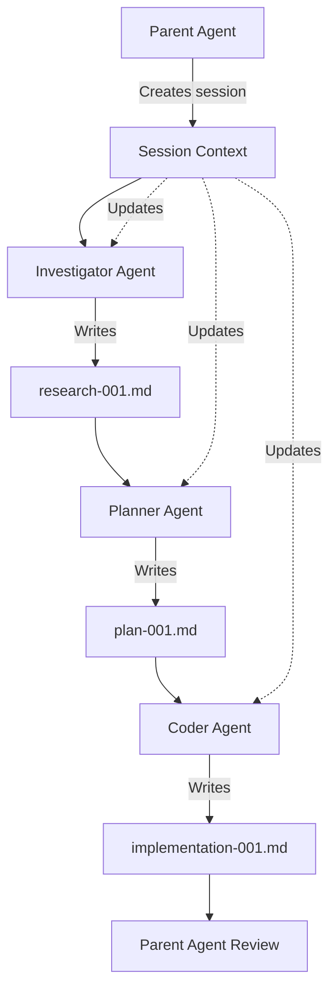

# Filesystem as Context: Implementation Plan

## Overview
This document outlines the implementation of a filesystem-based context sharing system for Claude Code agents, addressing context window limitations by using persistent file storage as shared memory.

## Problem Statement
- Context windows (128K tokens) are insufficient for complex multi-agent workflows
- Model performance degrades with excessive context
- Long inputs are expensive even with prefix caching
- Information loss from aggressive compression strategies
- Agents need to share state without polluting each other's context

## Solution Architecture

### Directory Structure
```
.claude/
├── doc/                      # Agent output documents
│   ├── plan-*.md            # Implementation plans
│   ├── analysis-*.md        # Analysis results
│   ├── research-*.md        # Research findings
│   └── implementation-*.md  # Implementation details
├── sessions/                 # Shared session context
│   ├── context_session_*.md # Current session context
│   └── archive/             # Archived sessions
└── knowledge/               # Persistent knowledge base
    ├── patterns/            # Discovered patterns
    ├── decisions/           # Architecture decisions
    └── learnings/           # Accumulated learnings
```

## Implementation Phases

### Phase 1: Agent Prompt Updates
Each agent prompt needs the following additions:

#### 1.1 Context Retrieval Section
```markdown
## Context Management

Before starting work:
1. Check for session context: `.claude/sessions/context_session_*.md`
2. Review relevant docs in `.claude/doc/` 
3. Load any necessary knowledge from `.claude/knowledge/`

Use these tools for retrieval:
- Read: Direct file access
- mcp__context7__*: Documentation retrieval
- WebSearch: Current information
```

#### 1.2 Output Format Section
```markdown
## Output Format

Your final message MUST include:
1. The implementation plan file path created at `.claude/doc/[type]-[timestamp].md`
2. Key decisions and rationale (3-5 bullet points)
3. Next steps for the parent agent

Example:
"I've created a comprehensive plan at `.claude/doc/plan-20241116-123456.md`

Key points:
- Chose React over Vue for consistency with existing codebase
- Database migration required before implementation
- Estimated 3 days for complete implementation

Please review the plan before proceeding with implementation."
```

#### 1.3 Documentation Requirements
```markdown
## Documentation Standards

All output documents must include:
- **Summary**: 2-3 sentence overview
- **Context**: Links to related documents
- **Details**: Main content with clear sections
- **Decisions**: Key choices and rationale
- **Next Steps**: Clear action items
- **Metadata**: Timestamp, agent, session ID
```

### Phase 2: Session Context Management

#### 2.1 Session Context File Format
```markdown
# Session Context: [Session ID]
**Created**: [Timestamp]
**Last Updated**: [Timestamp]
**Main Objective**: [High-level goal]

## Current State
- Active task: [Current focus]
- Progress: [Percentage or phase]
- Blockers: [Any issues]

## Key Decisions
1. [Decision]: [Rationale]
2. [Decision]: [Rationale]

## File References
- Plans: [List of plan files]
- Analysis: [List of analysis files]
- Implementation: [List of implementation files]

## Agent Activity Log
| Timestamp | Agent | Action | Output File |
|-----------|-------|--------|-------------|
| [Time] | [Agent] | [Action] | [File] |
```

#### 2.2 Context Update Rules
- Main agent creates initial session context
- Each subagent appends to activity log
- Critical decisions require context update
- Session archived on completion

### Phase 3: Agent Tool Enhancements

#### 3.1 New Tool Permissions
Update `settings.json` to include:
```json
{
  "tools": {
    "all_agents": ["Read", "Write", "mcp__context7__*"],
    "investigator": ["WebSearch", "mcp__brave-search__*"],
    "planner": ["mcp__filesystem__create_directory"]
  }
}
```

#### 3.2 Document Templates
Create templates for common document types:

**Plan Template** (`plan-template.md`):
```markdown
# Implementation Plan: [Feature Name]
**Created**: [Timestamp]
**Agent**: [Agent Name]
**Session**: [Session ID]

## Executive Summary
[2-3 sentences]

## Architecture Overview
[High-level design]

## Implementation Phases
### Phase 1: [Name]
- Objective: [Goal]
- Tasks: [List]
- Validation: [Criteria]

## Risk Analysis
| Risk | Impact | Mitigation |
|------|--------|------------|
| [Risk] | [L/M/H] | [Strategy] |

## Success Criteria
- [ ] [Criterion]
- [ ] [Criterion]
```

### Phase 4: Agent Workflow Updates

#### 4.1 Investigator Agent
```markdown
## Workflow Updates
1. Start: Load session context
2. Research: Save findings to `.claude/doc/research-*.md`
3. Analysis: Create `.claude/doc/analysis-*.md`
4. Patterns: Update `.claude/knowledge/patterns/`
5. End: Update session context with findings
```

#### 4.2 Planner Agent
```markdown
## Workflow Updates
1. Start: Review research/analysis docs
2. Plan: Create `.claude/doc/plan-*.md`
3. Decisions: Document in `.claude/knowledge/decisions/`
4. End: Update session with plan reference
```

#### 4.3 Coder Agent
```markdown
## Workflow Updates
1. Start: Load plan from `.claude/doc/plan-*.md`
2. Implement: Track progress in session context
3. Document: Save details to `.claude/doc/implementation-*.md`
4. End: Update session with completion status
```

### Phase 5: Parent Agent Coordination

#### 5.1 Parent Agent Rules
```markdown
## Subagent Coordination Rules

When launching subagents:
1. Create/update session context first
2. Pass session ID to subagent
3. Specify expected output document type
4. Review output document before next agent

Example:
"Use investigator agent to research [topic]. 
Save findings to `.claude/doc/research-[timestamp].md`
Session context: `.claude/sessions/context_session_001.md`"
```

#### 5.2 Context Handoff Pattern
```python
# Pseudo-code for context handoff
session_id = create_session_context(objective)
research_doc = launch_agent("investigator", session_id)
plan_doc = launch_agent("planner", session_id, research_doc)
impl_doc = launch_agent("coder", session_id, plan_doc)
update_session_context(session_id, "completed")
```

## Implementation Checklist

### Immediate Actions
- [x] Create directory structure (`.claude/doc/`, `.claude/sessions/`)
- [ ] Update top 5 agents with output format sections
- [ ] Create document templates
- [ ] Write session management utilities
- [ ] Test with simple workflow

### Phase 1 Updates (High Priority Agents)
- [ ] investigator.md - Add output format and context retrieval
- [ ] planner.md - Add output format and context retrieval
- [ ] coder.md - Add output format and context retrieval
- [ ] test-writer.md - Add output format and context retrieval
- [ ] committer.md - Add output format and context retrieval

### Phase 2 Updates (Secondary Agents)
- [ ] pr-drafter.md - Add output format
- [ ] linter.md - Add output format
- [ ] screenshot.md - Add output format
- [ ] meta-agent.md - Add output format
- [ ] hook-creator.md - Add output format

### Validation Criteria
- [ ] Agents successfully write to `.claude/doc/`
- [ ] Session context maintains state across agents
- [ ] Parent agent can read subagent outputs
- [ ] No context window overflow in typical workflows
- [ ] Knowledge accumulates in `.claude/knowledge/`

## Benefits

1. **Unlimited Context**: Filesystem has no token limits
2. **Persistent Memory**: Information survives across sessions
3. **Parallel Processing**: Agents can work without blocking
4. **Audit Trail**: Complete history of decisions and actions
5. **Knowledge Building**: Patterns and learnings accumulate
6. **Cost Efficiency**: Reduced token usage from context sharing

## Example Workflow



## Success Metrics

- 50% reduction in context token usage
- Zero context overflow errors
- 100% traceability of agent decisions
- Successful multi-agent workflows without context pollution
- Knowledge base growth over time

## Next Steps

1. Implement Phase 1 agent updates
2. Create utility functions for session management
3. Test with EPCC workflow
4. Measure token usage reduction
5. Iterate based on learnings

---
**Status**: Ready for implementation
**Priority**: High
**Estimated Time**: 2-3 days for full implementation